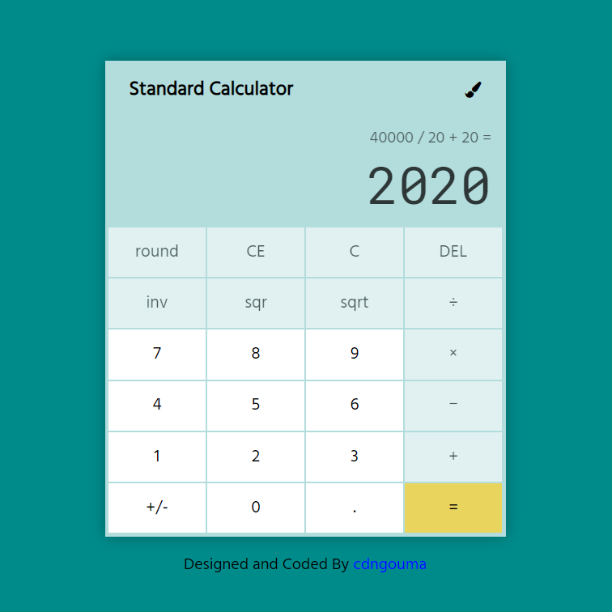

This project is part of the <a href="https://www.freecodecamp.org/learn/front-end-libraries/front-end-libraries-projects/build-a-javascript-calculator" target="_blank">FreeCodeCamp</a> Front End Libraries Certification program.
## Js-calculator
A JavaScript standard calculator build with React. Click <a href="https://cdngouma.github.io/js-calculator/" target="_blank">here</a> for a demo.
The app was implemented using the formula/expression logic to compute the result. i.e. `3 + 5 x 6 - 2 / 4 = 32.5` and supports all basic operations and more.

